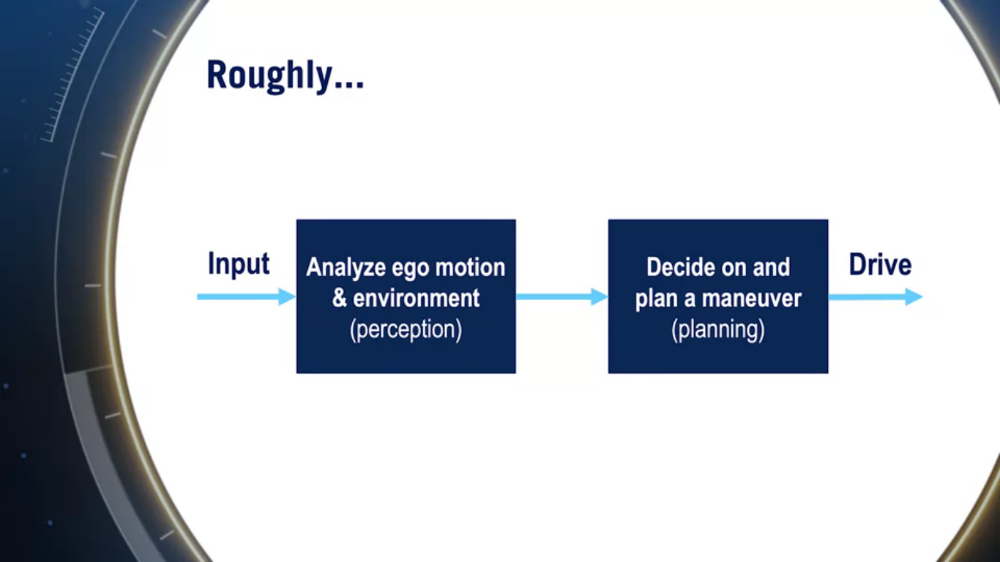
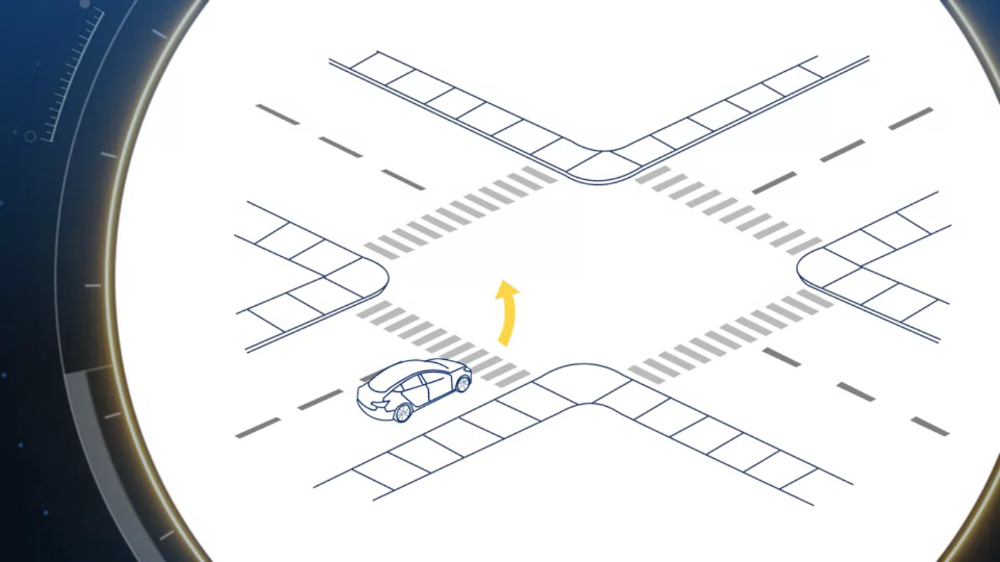
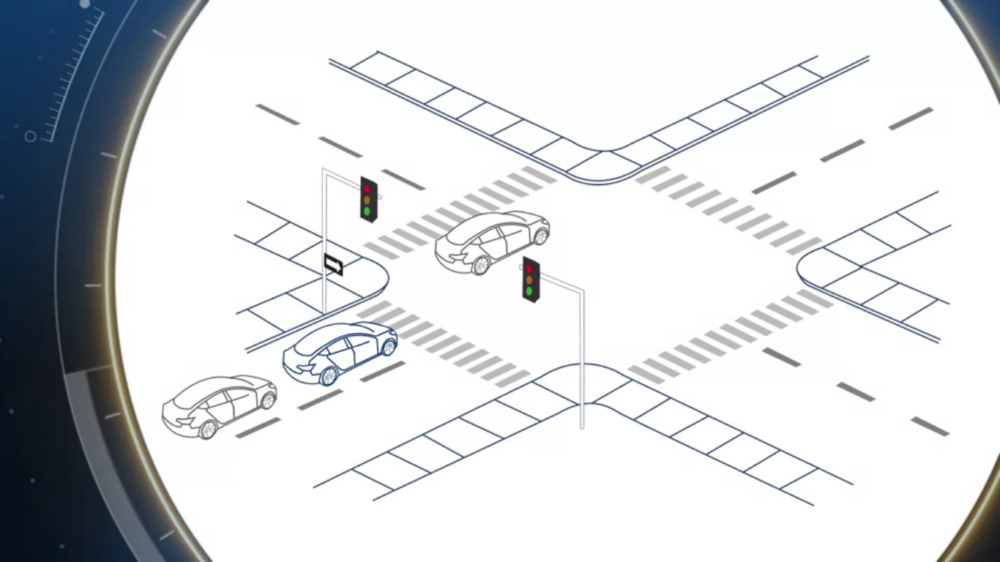

# *In the name of Allah the Merciful*

# Introduction to Self-Driving Cars - Week 1

## Course Objectives
> This course will introduce you to the terminology, design considerations and safety assessment of self-driving cars. By the end of this course, you will be able to: - Understand commonly used hardware used for self-driving cars - Identify the main components of the self-driving software stack - Program vehicle modelling and control - Analyze the safety frameworks and current industry practices for vehicle development For the final project in this course, you will develop control code to navigate a self-driving car around a racetrack in the CARLA simulation environment. You will construct longitudinal and lateral dynamic models for a vehicle and create controllers that regulate speed and path tracking performance using Python. You’ll test the limits of your control design and learn the challenges inherent in driving at the limit of vehicle performance. This is an advanced course, intended for learners with a background in mechanical engineering, computer and electrical engineering, or robotics.

## Week Objectives
 >   Review the layout of the courses in the Specialization
     Review the main projects offered in this course
     Examine the state of the self-driving industry

## Table of Contents
* Introduction to Self-Driving Cars
  * 
  * 
  * ![Glossary of Terms][#Glossary of terms]
* 
  * 
  * ![Lesson 2: Requirements for Perception]
  * ![Lesson 3: Driving Decisions and Actions]
  
## Introduction to Self-Driving cars  
  
### Welcome to The Course
By the end of this course you will:
- Learn about the elements of driving: perception, prediction, decision making
- Understand how to design the software and hardware stack to do autonomous driving
- Understand common safety practices for autonomous driving
- Learn the basics of vehicle modeling and control, and design controllers to do speed regulation, path following, etc...
- Use the above concpets to help navigate a self driving car in CARLA.

### The Story of Autonomous Vehicles
- The dream of SDC is almost old as the automobile,
  - In 1925, someone has demonstrated a remote control car to frighten passerby with a car an empty driver seat
  - In 1956, GM has made a promotional video claiming that SDC would arrive by 1976, this SDC would take full control on the highway and the driver can interact with the car by voice control features.

- There is no doubt that one of the most dangerous things we do on a rigular basis is driving our cars.
- Over 94% of the nowadays accidents are caused by human error.
- SDC objective is to minimize or completely eliminate driving deaths by taking human error out of the picture, and another objective is increasing luxury in our cars as we can reply to our mail, eat or relax instead of focusing on lanes, turns, cars, etc..

- The SDC industry has reached many milestones starting from 1990 until now
- The first SDC accident has occured in Florida by a *Tesla Model S* in 2016, This was caused by a simultaneous failure of both camera and radar sensors to correctly identify a *left turning transport truck* and the driver was inattentive, but this accident didn't affect the progress continuity.
- In 2016, the autonomous taxi fleets started to become popular, two startups (Zoox, nuTonomy) were leading this way
- In 2018, the first death accident has occurred by an *Uber vehicle*, This incident has affected the autonous vehicle testing community, and Uber has also stopped testing until they fully investigate the accident details

- There are some challenges still facing the SDC systems during testing:
  - Nowadays, the number of miles being driven by SDC in hard-conditions is exploding, so that the number of accidents are is predicted to also go up (Waymo announced that in fall 2018, they have completed over 10 million miles of autonomous driving!).
  - Human interventions are continously growing
  - The SDC performance is now very near to the human performance, and this is the reason why this industry needs more support than ever to meet and exceed this ambitious goal.
  
 - Nowadays, there are many newly established companies pushing to bring truly driverless cars to market as early as 2020.
 - The techonology is still quietly expensive, but prices will fall quickly when there is a market need for this solution.
 - There is so much to be done to bring about the expected transformational change to bring autonomous cars to society, and the industry is in continous need for outstanding engineers to produce innovative solutions for driving.
 
 
### Glossary of Terms

##### ACC: Adaptive Cruise Control
A cruise control system for vehicles which controls longitudinal speed. ACC can maintain a desired reference speed or adjust its speed accordingly to maintain safe driving distances to other vehicles.

##### Ego
A term to express the notion of self, which is used to refer to the vehicle being controlled autonomously, as opposed to other vehicles or objects in the scene. It is most often used in the form ego-vehicle, meaning the self-vehicle.

##### FMEA: Failure Mode and Effects Analysis
A bottom up approach of failure analysis which examines individual causes and determines their effects on the higher level system.

##### GNSS: Global Navigation Satellite System
A generic term for all satellite systems which provide position estimation. The Global Positioning System (GPS) made by the United States is a type of GNSS. Another example is the Russian made GLONASS (Globalnaya Navigazionnaya Sputnikovaya Sistema).

##### HAZOP: Hazard and Operability Study
A variation of FMEA (Failure Mode and Effects Analysis) which uses guide words to brainstorm over sets of possible failures that can arise.

##### IMU: Inertial Measurement Unit
A sensor device consisting of an accelerometer and a gyroscope. The IMU is used to measure vehicle acceleration and angular velocity, and its data can be fused with other sensors for state estimation.

##### LIDAR: Light Detection and Ranging
A type of sensor which detects range by transmitting light and measuring return time and shifts of the reflected signal.

##### LTI: Linear Time Invariant
A linear system whose dynamics do not change with time. For example, a car using the unicycle model is a LTI system. If the model includes the tires degrading over time (and changing the vehicle dynamics), then the system would no longer be LTI.

##### LQR: Linear Quadratic Regulation
A method of control utilizing full state feedback. The method seeks to optimize a quadratic cost function dependent on the state and control input.

##### MPC: Model Predictive Control
A method of control whose control input optimizes a user defined cost function over a finite time horizon. A common form of MPC is finite horizon LQR (linear quadratic regulation).

##### NHTSA: National Highway Traffic Safety Administration
An agency of the Executive Branch of the U.S. government who has developed a 12-part framework to structure safety assessment for autonomous driving. The framework can be found [here](https://www.nhtsa.gov/sites/nhtsa.dot.gov/files/documents/13069a-ads2.0_090617_v9a_tag.pdf)

##### ODD: Operational Design Domain
The set of conditions under which a given system is designed to function. For example, a self driving car can have a control system designed for driving in urban environments, and another for driving on the highway.

##### OEDR: Object and Event Detection and Response
The ability to detect objects and events that immediately affect the driving task, and to react to them appropriately. 

##### PID: Proportional Integral Derivative Control
A common method of control defined by 3 gains.
1. A proportional gain which scales the control output based on the amount of the error
2. An integral gain which scales the control output based on the amount of accumulated error
3. A derivative gain which scales the control output based on the error rate of change

##### RADAR: Radio Detection And Ranging
A type of sensor which detects range and movement by transmitting radio waves and measuring return time and shifts of the reflected signal.

##### SONAR: Sound Navigation And Ranging
A type of sensor which detects range and movement by transmitting sound waves and measuring return time and shifts of the reflected signal.

## Module 1: Driving Taxonomy, Perception and Driving Decisions
> In this module, we discuss the taxonomy of driving automation, perception needs for the driving task, and we will tackle the question of how to make driving decisions and actions. The goal of this module is to refer to how many assessments and decisions are driving task truly requires.

### Lesson 1: Taxonomy of Driving
- It's important to understand autonomous vehicle requirements and how we define self-driving for a car.
- We will go through some terms and definitions that will be used throughout the specialization:
  - Driving task:
  This task is made-up of three sub-tasks:
    - Perception
    This includes tracking the car's motion, identifying the various elements around the car, tracking moving objects and predict their future motions.
    - Motion planning
    This allows us to reach our destination from point A to B successfuly (determine when you should change lanes, cross an intesection, and how to execute swerve maneuver when needed
    - Conrolling the vehicle
    This allows us to control the acceleration, brakes, steering angle, etc...
  - Operational Design Domain (ODD)
  This constitues the operating conditions for which a SDC is designed to function (environmental conditions, daytime, roadway, ...). The ODD is crucial to ensuring the safety of the system.

- What makes up the driving task?
  - Lateral Control
  This refers to the task of steering and navigating laterally on the road, like turning left, right, moving straight, track a curve, ...
  - Longitudinal Control
  This is where the car position and velocity are controlled through the actions of breaking and acceleration.
  - Object and Event Detection and Response (OEDR) 
  It's the ability to simultaneously **detect** objects and events that immediately affect the driving task, and **react** to them.
  - Planning
  As the OEDR is responsible for the immediate actions, the planning part is responsible for both short term and long term actions.
  - Miscellaneous tasks
  These are the many other tasks that we do while driving (like signaling with indicators, handwaving, interacting with other drivers, ...).
  
- The levels of driving automation describe the above tasks, and are defined by SAE  in [this link](https://www.sae.org/standards/content/j3016_201806/).
  - Level 0: No automation
  - Level 1: Driving assistance\
  Assisting in **either** Longitudinal control or lateral control, but not both (ex.: adaptive cruise control, lane keeping assistance)
  
  - Level 2: Partial driving automation\
  Assisting in **both** Longitudinal control and lateral control (ex.: GM super cruise, Nissan pro-pilot assist)
  Nowadays, many manufacturers are offering this level of autonmous vehicles including (Mercedes, Audi, Tesla and Hyundai)
  
  - Level 3: Conditional driving automation\
  This system combines both control tasks and OEDR to a certain degree, and the driver doesn't need to pay attention in some specific situations, but in the case of failure, the vehicle sends alert to the driver and driver must take control. (ex.: Audi A8 sedan which can navigate unmonitored in slow traffic).
  
  - Level 4: High driving automation\
  This system combines control tasks, OEDR and Fallbacks. Making the system capable of reaching a minimum risking conditions so that the driver can entirely focus on other tasks and the car handles emergencies autonomously, but this system may still ask the driver to take control in some cases. However, level 4 systems still have some permissions as they are operating with a limited ODD. We may have two car models to claim level 4 autonomous system but with very different ODD (ex.: as of fall 2018, only Waymo that has launched their level 4 vehicles for public transporation .. and these vehicles can only handle the driving task in a defined geographic area with a set of operating conditions).
  
  - Level 5: Fully autonomous\
  This system has unlimited ODD. (ex.: No examples yet for this level)
  
  
### Lesson 2: Requirements for Perception
- Lesson objectives:
  - Perception defintion
  - Goals for perception
  - Challenges to perception
  
- Roughly, the driving task may be split into two components:

- To build a SDC, we need to perform OEDR and as we know, perception is one of the most important tasks in the OEDR.
- What is Perecption? .. It's the process in which SDC makes sense of the environment
- For any agent (element) on the road, the SDC should perform 2 main things:
  - **Identify** what the agent is (car, bike, bus, ...)
  - **Understand** the agent's motion to then predict what the agent will do next.
- It's easy for humans to perform perception, but it's still difficult for computers to recognize the patterns as humans. We also can predict the trajectory of a moving object, and it's not easy at all for machines to do so.

    
- What do we need from perception? (Goals for perception)
  - Identify static objects\
  Road and lane markings, curbs (the road boundaries), traffic signals, road signs (these are off-road signs), construction signs (on-road signs), etc..
  - Identify and predict dynamic objects\
  Vehicles on the road (both the 4-wheelers and 2-wheelers, btw 2-wheelers are more difficult to predict as they have more degrees of freedom), pedesterians (much more difficult as they have more degrees of freedom.)
  - Ego localization\ 
  To estimate where we are and how we are moving at any moment. The data used for this task comes from GPS, IMU, sensors. and they all need to be combined together to form a robust picture)
  *The second and third courses in the specialization cover the 3 above tasks in details*

- Why perception is hard? (Challenges to perception)
  - We need as much robust detection and segmentation as we can to achieve the human level capability, we also need very large datasets.
  - Perception is not ammune to *uncertainty* as there are many times that GPS, RADAR, LIDAR, or sensors are giving noisy data, so that any subsystem must take uncertainty conditions into account.
  - Visual effects -like occlusion, reflection, illumination issues, lins flare from cameras or LIDAR data- can confuse the perception tasks with un-accurate indicators.
    - **Accurate perception needs multiple redundant sources of information to overcome data loss**
  - Weather conditions and precipitation are having strong effect on the perception task (RADAR and LIDAR are immune to this issue).

### Lesson 3: Driving Decisions and Actions
- Lesson objectives:
  - Planning: types (with respect to *time*) and examples
  - Examples about decisions needed for a simple intersection scenario
  - Planning types (with respect to *logic*)
  
- Decision making is a part of the Planning task.
- We have three types of planning (wrt. time):
  - Long Term\
  A high level plan for the entire driving task, like the driving instructions we get from our mapping appications when we want to navigate from New York to Los Angeles (which roads and which lanes to take)
  - Short Term\
  This is the decision of answering the kind of questions like (can I change lanes rightnow? .. can I pass this intersection and join the left road? ..)
  - Immediate Decisions\
  This decision involves the control and trajectory planning (can I stay on track on this curved lane? if not, can I follow this lane by either way? and what steering input should I apply? how much acceleration or brake do I need?)
  
- The following example (and all the upcoming examples) are assuming right-handed driving.

Consider a car at the intersection and wants to turn left, lets consider some scenarios and the corresponding short term and immediate decisions to successfuly do this operation.

**Assume** that the intersection has traffic lights so that the agents motions are controlled
- We need to decide if we should make a left lane change before turning left (remember we are assuming right-handed driving)
- As we approach the intersection, we may decide to make a hard slow down or we will most likely decide to slow down smoothly
- If the traffic light is red then we need to **Stop** just before the pedesterians crossing lines\
*The above decisions are all short term decisions.*
- But we also need to think and respond to situations around the way, so we need **OEDR** in our decision making
  - What if another car has came in front of us before reaching the traffic line? -- we need to stop earlier than the last case in order not to crash with the leading vehicle
  - What if the pedesterians crossing line are not marked? -- we need to approximately predict them and stop before our prediction
  - What if other vehicles are blocking us from making the left turn, how will we respond?

*The above decisions are all immediate decisions to make*

So for a simple scenario like this, we need to make many decisions and deal with too many different cases in the real-time.
For this simple maneuver, we took 3-4 levels of decisions and control to execute

- Now, for a general scenario, consider how many rules would it take to drive:
  - Safely
  - efficiently
  - following all traffinc rules

- The conclusion from this discussion is that driving task is **COMPLICATED**, that's why we need a software structure for the multi-level decision making which name is *rule based planning*.
- Rule based planning is split into two types:
  - Reactive planning\
  We have rules that take into account the current state of ego vehicle and other objects, and give immediate decisions, these rules only consider the current states, not future predictions. (In the reactive planning we are considering what is happening **rightnow** and make our decision based on these immediately available information).
  ex.: if there is a pedesterian on the road, STOP ... if the speed limit changes, adjust your speed

  - Predictive planning\
  We make predictions on how the other agents will respond over time, then use these predictions to inform our decisions.
  This is more similar to the human natural thinking so it's a very complex task
  ex.: the pedesterian is jaywalking, they will enter our lane by the time we reach her, so we will slow down to prevent a possible crash.
  
  
- We will cover the planning tasks in details in course 4 isA. but for more information about decision making rightnow, check [this paper](https://ieeexplore.ieee.org/abstract/document/7490340) and [this](https://onlinelibrary.wiley.com/doi/abs/10.1002/rob.20255).
