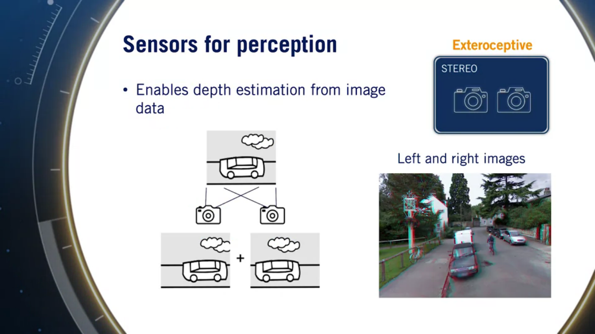
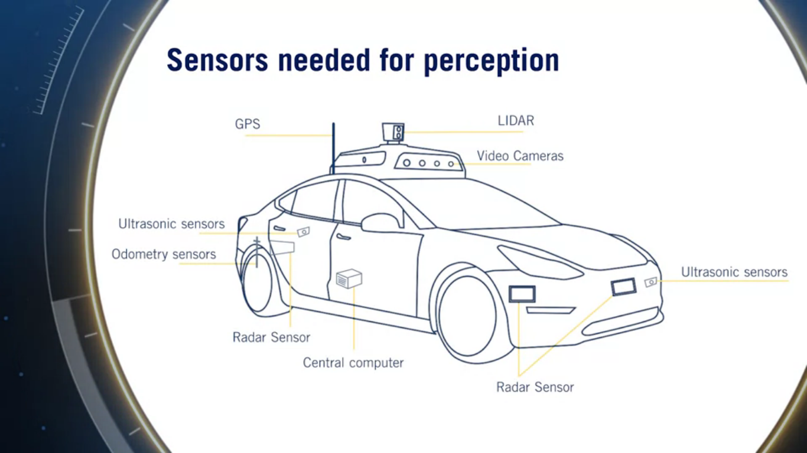
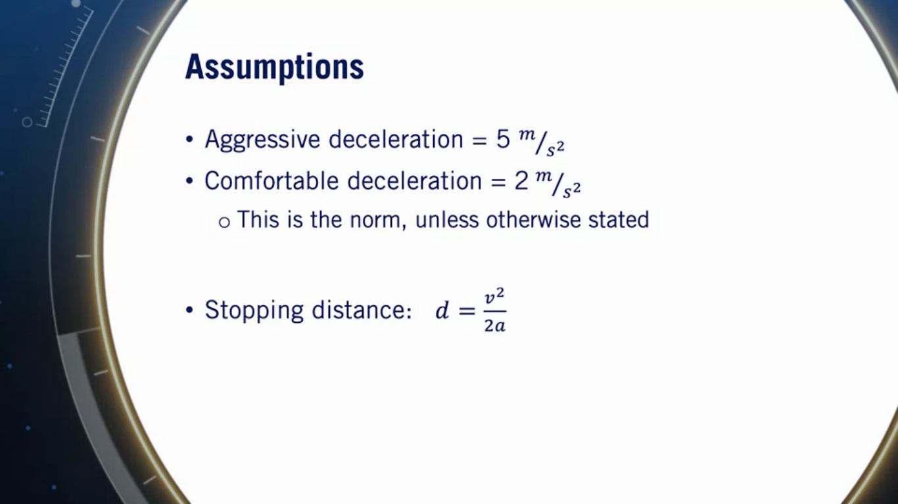
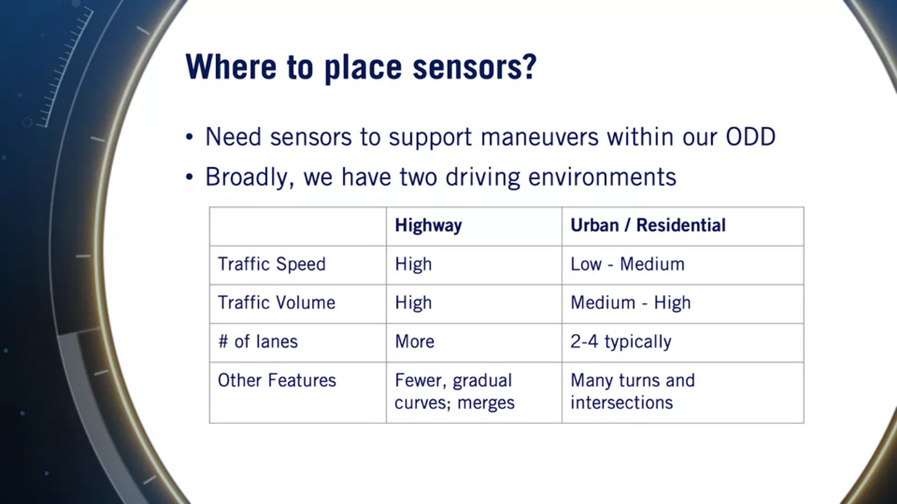

# *In the name of Allah the Merciful*

# Introduction to Self-Driving Cars - Week 2

## Week Objectives
>   Design an omni-directional multi-sensor system for an autonomous vehicle\
    Describe the basic architecture of a typical self-driving software system\
    Break down the mapping requirements for self-driving cars based on their intended uses.
    
## Table of Contents
* Autonomous Vehicle Hadware, Software and Environment Representation
  * [Lesson 1: Sensors and Computing Hardware]
  * [Lesson 2: Hardware Configuration Design]
  
  
  
  
  
  
  
  
### Lesson 1: Sensors and Computing Hardware
-In this module we will get to know about:
  - Sensors for perception
  - Self-driving computing hardware
  - Designing hardware configurations
  - Software architecture, decomposition
  - Environment representation for self-driving

-In this lesson we will cover:
  - Sensors types and characteristics
  - Self-driving cars computing hardware

#### Sensors
- Even the best perception algorithms are limited by the quality of their sensor data,
so it's crucial to carefully select your sensors
- Sensors can be categorized into two types:
  - Exteroceptive --> sensors which record the outside environment (extero == surroundings)
  - Proprioceptive --> record the properties of the ego vehicle (proprio == internal)
  
We will discuss in the next lines about specific sensors, their importance and their comparison metrics.
- Examples of Exteroceptive sensors:
##### Camera
    It's a passive, light-collecting sensor, it's used to capture rich detailed visual information about the scene.
    Some people believe that the camera is the only sensor truly needed for a self driving car
      - Comparison metrics:
        - Resolution --> number of pixels that create the image (e.g.: it specifies the quality of the image)
        - Field of View --> the area that is visible to the camera, it can be varied through lens selection and zoom.
        - Dynamic Range --> the difference between the darkest and lightest tones in an image,
         (it's critical for SDCs to have high dynamic range cameras because of the highly variable lighting conditions on road).
     There is a trade-off between the FOV and resolution,
     as wider range of view forces fewer pixels to absorb light from one particular object and vice versa.
     In other words, as the FOV increases, resolution needs to be increased as well in order to maintain the same image quality.
     important definition to discuss is the *Stereo camera*:
     Stereo camera is a combination of 2 cameras with overlapping fields of view and aligned image planes,
     stereo camera allow depth estimation from synchronized image pairs,
     and it produces a disparity map of the scene by matching pixel values from image from *camera 1* with that of the *camera 2*
     Desparity map can be used to estimate depth at each pixel.
     
     
     We will go through more details about cameras in course 3 isA.
     
##### LIDAR
    Light Detection and Ranging sensor.
    LIDAR shoots light beams into the environment and meausring the reflected return, from these measurements, intensity and range of the reflected beams, it can estimate a 3D map of the reflected object
    LIDAR is usually based on a spinning element with multiple stacked light sources, but a new LIDAR type (HD solid-state LIDAR) is coming soon with these specs: (high resolution, solid state - with no spinning element- , low cost, reliable) 
    LIDAR is ammune to weather and lighting conditions
      - Comparison metrics:
        - Number of beam sources --> it may contain 8, 16, 32, 64 sources and these are the common sizes
        - Points per second --> the faster the point per second collection, the more detailed the 3D cloud map can be.
        - Rotation rate --> the higher this rate, the faster the 3D point clouds are updated.
        - Detection range 
        - Field of view
      
##### RADAR
    Radio Detection and Ranging sensor.
    RADAR detects large objects and giving relative speed estimation robustly
    RADAR is ammune to weather and lighting condition
      - Comparison metrics:
        - Detection range
        - Field of view
        - position & speed measuremnt accuracy
        
      - RADAR has some configurations:
        - short range, wide field of view
        - long range, narrow field of view
      
 ##### SONAR (ultrasonics)
    SONAR is a short range, low-cost sensor
    It's used widely for parking scenarios
    Robust to lighting and precipitation conditions
    - Comparison metrics:
      - Maximum range
      - Detection FOV
      - Cost
       
  - Proprioceptive Sensors:
  
 ##### GNSS
    Measure ego vehicle position and velocity
    GNSS accuracy varies depending on the actual positioning methods and the corrections used (RTK, PPP, DGPS)
##### IMU
    Measure the angular rotation rate and acceleration
    - Both the GNSS and IMU combined can be used to estimate 3D orientation of the vehicle (heading)
    
##### Wheel odometry
    Measures and tracks the wheel velocity and orientation and uses these measurements to calculate overall speed and orientation (position drift) of the car.
    It's the same sensor that tracks the mileage on our vehicles
    

#### To Conclude
- it's too important to carefully select your combination of sensors with the appropriate configurations.
- Camera is used for appearance inputs
- Stereo camera used for depth information
- LIDAR used for all 3D inputs
- RADAR used for object detection
- Ultrasonic used for the short-range 3D objects
- GNSS/IMU/Wheel odometry used for ego state estimation

#### Computing Hardware
    We need a very powerful hardware to take in all sensors data, compute and output the needed commands to drive the vehicle
    Most companies prefer to design their own specific hardware, but some generic hardware options are available (ex.: Nvidia drive PX, Intel & Mobileye 'eyeQ')\
    Of course the hardware contains either GPUs, FPGAs or custom ASICs to do the specific type of computation we need for image processing, segmentation, ...
    Also the hardware must sync all the different modules on the system and serve a common clock for each of them (GPS maybe the reference clock).
    

### Lesson 2: Hardware Configuration Design
- In this lesson we will cover:
  - Configuration design to meet sensor coverage requirements for both *highway* and *urban* scenarios
  - layout the overall coverage and blind spots -> (design issues)

- Every sensor has its specific configuration and field of view, so the question is how to place these sensors to aggregate a complete view of the environment.

- Assume that these are the deceleration rates that we will accept for driving, we will use these assumptions to derive the detecton range needed for our sensors:

#### Now we have to place our sensors so that we can achieve the target ODD
We will consider the 2 main scenarios: highway and urban, listing a brief comparison between each of them:

      
      
